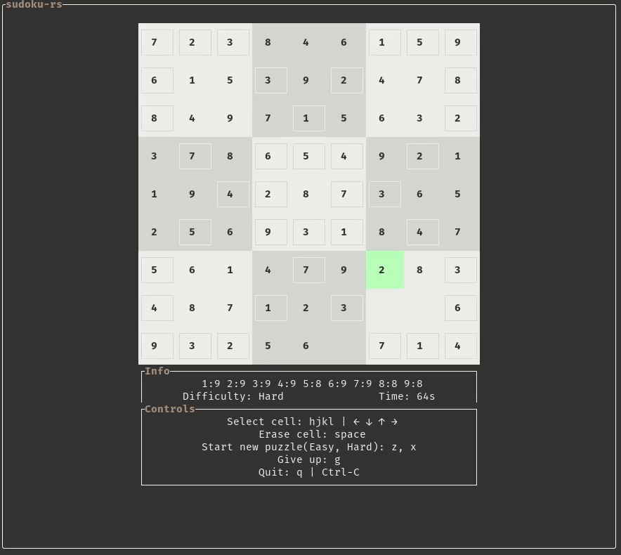
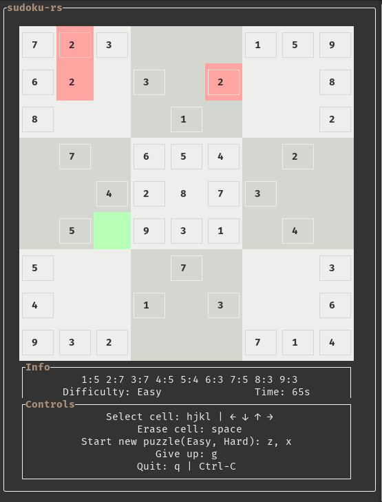
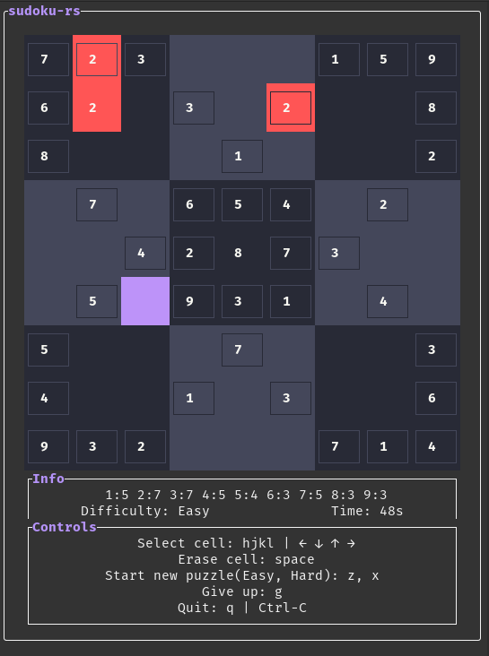

# sudoku-rs

Fully featured Sudoku right in your terminal, built over a weekend using [tui-rs](https://github.com/fdehau/tui-rs).

## Demo

    

## Building & Themes

There are two themes available, Tranquil and Dracula

| `cargo build --features tranquil` | `cargo build --features dracula` |
| :-------------------------------: | :------------------------------: |
|     |     |

Or you can add your own in [themes.rs](./src/themes.rs)

## Puzzle Generation

Puzzle generation technique was taken from [this great Stack Excahnge answer](https://gamedev.stackexchange.com/a/76170)

Puzzle "seeds" are generated from [here](https://qqwing.com/generate.html).

A series of transformations is then applied to a seed
1. Remap tokens, for example mapping all 1s to 9s and 9s to 1s still gives us a solvable puzzle (~300,000 variations)
2. Rotate the puzzle by 0, 90, 180 or 270 degrees (4 variations)
3. Reflect the puzzle vertically, horizontally, both or neither (4 variations)

This way one seed can be used to create ~48,000,000 different puzzles